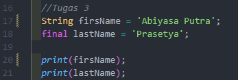
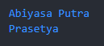
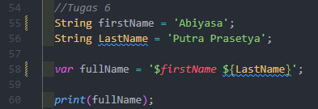
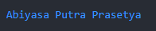
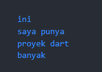

  <h3 align="center">PEMROGRAMAN MOBILE</h3>
  <h3 align="center">KUIS 1</h3>
  

  <h3 align="center">Abiyasa Putra Prasetya</h3>
  <h3 align="center">3G - D4TI</h3>
  <h3 align="center">01</h3>
  <h3 align="center">2141720203</h3>

# Tugas 1

Output:

<h4>Penjelasan: Fungsi dari print yaitu untuk menampilkan output ke dalam console dan akan menampilkan "Hello World"<h4>

# Tugas 2

Output:

<h4>Penjelasan: Terdapat variabel name yaitu menggunakan tipe data String yang digunakan untuk menyimpan teks. Kemudian variabel tersebut dipanggil menggunakan print sebanyak 3 kali, jadi akan menampilkan nama sebanyak 3 kali.<h4>

# Tugas 3

Output:

<h4>Penjelasan: Terdapat 2 variabel, untuk yang pertama yaitu variabel firstName dengan nilai Abiyasa Putra menggunakan tipe data String Kemudian untuk variabel yang kedua yaitu variabel lastName dengan nilai Prasetya sebagai final yang artinya nilainya tidak dapat diubah lagi. Variabel ini juga memiliki tipe data String. <h4>

# Tugas 4

Output:

<h4>Penjelasan: Terdapat 2 variabel, untuk veriabel pertama yaitu menggunakan final dengan list nilai dari array1 yaitu [1, 2, 3] dan untuk variabel kedua menggunakan const dengan list nilai dari array2 yaitu [4, 5, 6] const menedefinisikan sebuah variabel sebagai konstan, dan kita tidak bisa merubah isi listnya. Dan karena itulah ketika dirun terjadi error karena kita mencoba memanggil variabel array2 dengan merubah isinya menjadi [100]<h4>

Perbaikan:

Variabel untuk array2 dirubah menjadi final.

# Tugas 4

Output:

<h4>Penjelasan: Ada 2 variabel, yang pertama yaitu int dengan nilai 100. Tipe data int digunakan untuk menampung nilai bilanga bulat. Dan untuk variabel yang kedua menggunakan double, yang digunakan untuk menampung nilai bilangan desimal. Kemudian kedua variabel tersebut dipanggil menggunakan print.<h4>

# Tugas 5

Output:

<h4>Penjelasan: Terdapat variabel yang menggunakan tipe data num yeng berfungsi untuk menampung nilai bilangan bulat maupun pecahan. Kemudian untuk number = 10.5 ini mengubah nilai awal yang semula adalah 10 menjadi 10.5. Lalu dicetak kembali variabel number menggunakan print.<h4>

# Tugas 6

Output:

<h4>Penjelasan: Ada beberap variabel yang menggunakan tipe data String. Untuk variabel firstName mendefinisikan nilai Abiyasa. Dan untuk variabel LastName mendefinisikan Putra Prasetya. Kemudian ada juga variabel var fullName dengan kode '$firstName ${lastName}' ini berguna untuk menggabungkan nilai dari kedua variabel tersebut. Namun outputnya error karena variabel firstName dengan menggunakan tipe data String sudah dideklarasikan sebelumnya.<h4>

Perbaikan:

Mengubah variabel firstName menjadi firstName2.

Output:

# Tugas 7

Output:

<h4>Penjelasan: Kode tersebut digunakan untuk menghindari masalah dengan karakter khusus dengan String<h4>

- \' digunakan untuk menampilkan karakter kutip satu dalam string. Dan juga untuk menganggapa bahwa kata yang dikutip dengan '\' itu bukan variabel.

- \$ digunakan untuk menampilkan karakter dolar dalam string.

# Tugas 8

Output:

<h4>Penjelasan: 'var name1 = firstName + lastName;' kode ini mendefinisikan untuk menggabungkan kedua nilai dari variabel firstName dan lastName dengan menggunakan operator '+'. Sedangkan untuk 'var name2 = 'Abiyasa' 'Putra' 'Prasetya';' kode ini menggabungkan ketiga String tanpa menggunakan operator, secara otomatis Dart akan menggabungkan String tersebut secara berurutan. Kemudaia dipanggil menggunakan print.<h4>

# Tugas 9

Output:

<h4>Penjelasan: 'var name1 = firstName + " " + lastName;' untuk kode ini berguna untuk menggabungkan variabel dengan spasi diantaranya. Kemudian untuk 'var name2 = 'Abiyasa' 'Putra' 'Prasetya';' menggabungkan ketiga String yang akan disimpan kedalam variabel name2. Kemudian dipanggil menggunakan print. Namun hasil outputnya error karena variabel name1 dan name2 dengan tipe data var sudah digunakan sebelumnya makanya terjadi error.<h4>

Perbaikan:

Ubah nama variabel menjadi name3 dan name4.

Output:

# Tugas 10

Output:

<h4>Penjelasan: 'var kalimat_panjang = '''' kode ini mendefinisikan variabel kalimat_panjang dan juga terdapat tanda kutip tiga yang berfungsi untuk membuat string multi-baris dalam Dart. Setelah itu variabel kalimat_panjang dipanggil menggunakan print untuk menampilkan output.<h4>